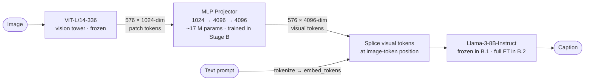
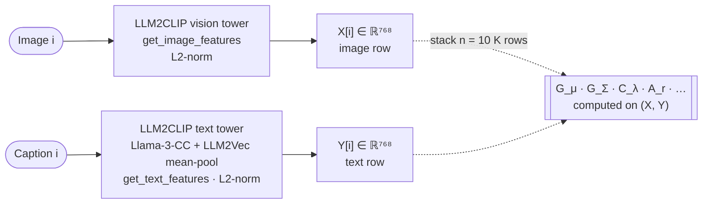
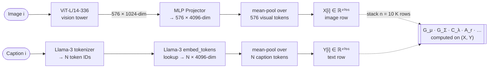

# Modality Gap Captioning — Diagnostic Phase

> Master thesis project — Data Science & Engineering, a.y. 2025–2026

Diagnostic-phase pipeline for measuring the **modality gap** in a Llama-3 + LLM2CLIP
multimodal large language model (MLLM), plus a zero-shot captioning baseline on COCO
Karpathy.

---

## Research Context

The **modality gap** is the empirical observation that, in contrastively trained encoders
(e.g. CLIP), image and text embeddings occupy *separate, non-overlapping cones* in the
shared representation space rather than being uniformly mixed.
Liang et al. (2022) established this for CLIP; more recent work extends the analysis to
the anisotropic structure of the residual vectors (after removing the centroid offset).

This project reproduces and extends the architecture from two papers:

| Paper | arXiv | Key contribution |
|---|---|---|
| **ReAlign** — Yu et al., 2026a | [2602.07026](https://arxiv.org/abs/2602.07026) | Theoretical analysis of modality gap in MLLMs + alignment correction |
| **AnisoAlign** — Yu et al., 2026b | [2605.07825](https://arxiv.org/abs/2605.07825) | Anisotropic residual structure; `d_eff`, `A_r` metrics |
| **Modality Gap** — Liang et al., 2022 | [2203.02053](https://arxiv.org/abs/2203.02053) | Original gap characterization in CLIP |

### Novel contribution

The papers measure the modality gap at **one point**: the encoder's contrastive output
space (768-dim, L2-normalized). This project measures it at **two points**:

1. **Encoder space** — `LLM2CLIP` shared 768-dim contrastive space. Same as papers.
2. **Projected-token space** — Llama-3 input embedding space (4096-dim), *after* the MLP
   projector has mapped vision tokens into the LLM. This is what actually reaches the
   LLM's attention layers.

Tracking how the projected-token gap evolves across three training checkpoints
(random-init projector → Stage 1 pretrained → Stage 2 fine-tuned) is the central
empirical question for this experiment.

### Architecture diagrams

The system has three conceptually distinct paths through the model: the
**inference pipeline** that produces captions, and the **two gap-measurement
taps** at the encoder and projected-token spaces. Each is shown separately
below.

#### 1 — Inference pipeline (what the model does at runtime)

This is the only path the model uses to generate a caption. It does **not**
mean-pool anything — the 576 visual tokens are kept and spliced into the LLM's
input sequence at the image-token position.



#### 2 — Measurement point ① · encoder space, d = 768

For each (image, caption) pair in the 10 K COCO-Karpathy diagnostic split we run
**both modalities through LLM2CLIP's contrastive heads** and L2-normalize. The
two resulting 768-dim vectors become row `i` of `X` (image) and row `i` of `Y`
(text). This is the gap the ReAlign / AnisoAlign papers measure.



#### 3 — Measurement point ② · projected-token space, d = 4096

This is the gap **inside the LLM's input embedding space** — the one the papers
don't measure. The image side is taken from the projector output; the text side
is taken from Llama-3's `embed_tokens` lookup table. Both sides are mean-pooled
to a single 4096-dim vector per sample. **The text path here does not invoke
the LLM's transformer layers at all — it only touches the embedding table.**



The image side of ② is repeated across **three checkpoints of the projector**
(random-init, Stage B.1, Stage B.2) to trace how the gap evolves with training.
The text side is invariant across those runs in Stage B.1 (LLM frozen) and may
shift in Stage B.2 (full LLM fine-tuning unfreezes `embed_tokens`).

---

## Architecture (locked)

All components are chosen to match the ReAlign / AnisoAlign papers exactly. Deviating
from these choices makes comparisons against paper numbers meaningless.

| Component | Choice |
|---|---|
| Vision encoder | `microsoft/LLM2CLIP-Openai-L-14-336` (HuggingFace) |
| LLM backbone | `meta-llama/Meta-Llama-3-8B-Instruct` (HuggingFace) |
| Projector | 2-layer MLP + GELU; in=1024, hidden=4096, out=4096 (~17M params) |
| Stage 1 data | Bunny-pretrain 1M — `BoyaWu10/Bunny-v1_0-data` |
| Stage 2 data | InternVL-Chat-V1.2-SFT |
| Diagnostic dataset | COCO Karpathy split — 10 K paired (image, caption) |
| Eval | COCO Karpathy test 5 K — CIDEr / BLEU-4 / METEOR / SPICE |

### LLM2CLIP two-checkpoint architecture

LLM2CLIP is **not** a single HuggingFace model. It uses two separate checkpoints:

- **Vision tower** — `microsoft/LLM2CLIP-Openai-L-14-336`: a fine-tuned CLIP ViT-L/14
  with a contrastive projection head that maps 1024-dim ViT tokens to 768-dim.
- **Text tower** — `microsoft/LLM2CLIP-Llama-3-8B-Instruct-CC-Finetuned`: a CC-finetuned
  Llama-3 wrapped via the `llm2vec` library (mean-pooling over tokens), followed by the
  vision tower's `get_text_features` head to project into the same 768-dim space.

The `LLM2CLIPEncoder` in `src/encoders/llm2clip_encoder.py` mirrors the reference
`embed.py` pipeline from `Yu-xm/ReVision` exactly, including the `LLM2Vec`
name-workaround required by its tokenizer.

### Projector input dimension

The projector ingests **vision-tower token features, not contrastive embeddings**.
ViT-L/14 produces 576 tokens of 1024-dim (the `last_hidden_state` minus the CLS token).
The 768-dim contrastive output of the vision tower is a separate linear projection used
only for gap measurement in encoder space — the projector never sees it.

### Float64 precision requirement

All gap-diagnostic embeddings are stored and computed in **Float64**.
Float32 accumulation introduces a ~10⁻⁸ error floor (documented in ReAlign Appendix E.2)
that contaminates centroid and covariance-based metrics. The `metrics.py` module enforces
this via `_to_f64()` at every entry point.

---

## Repository layout

```
configs/
  encoders.yaml           LLM2CLIP encoder config (dims, HF ids, device)
  projector.yaml          MLP projector config (in/hidden/out dims)
  llm.yaml                LLM backbone config (HF id, dtype, image token)
  data.yaml               Dataset paths and splits
  captioning.yaml         Inference / generation config
  training_stage1.yaml    Stage 1 optimizer, schedule, batch, DeepSpeed
  training_stage2.yaml    Stage 2 optimizer, schedule, batch, LoRA fallback
  deepspeed/
    zero2.json            ZeRO-2 config (Stage 1 + Stage 2 default)
    zero3.json            ZeRO-3 config (Stage 2 OOM fallback on 40GB A100)

src/
  encoders/
    base.py               Abstract Encoder interface
    llm2clip_encoder.py   LLM2CLIP two-checkpoint wrapper (vision + text)
  models/
    projector.py          MLP2xGELU projector (2-layer, GELU, ~17M params)
    vlm.py                Full VLM: encoder + projector + Llama-3 splice
    checkpoint.py         Save / load helpers for projector checkpoints
  diagnostics/
    extract_embeddings.py Extract encoder-space (768-dim) embeddings to disk
    extract_projected.py  Extract projected-token-space (4096-dim) embeddings
    metrics.py            All gap metrics — Float64, parameterized by d
    plots.py              Figures: centroid scatter, residual energy curves, UMAP
  data/
    coco_loader.py        COCO Karpathy loader (paired image + caption)
    bunny_loader.py       Bunny-pretrain 1M loader for Stage 1
    internvl_loader.py    InternVL SFT loader for Stage 2
    transforms.py         Image pre-processing utilities
  training/
    stage1_pretrain.py    Stage 1 training loop (projector-only, LLM frozen)
    stage2_sft.py         Stage 2 training loop (full FT or LoRA fallback)
    trainer_utils.py      Gradient accumulation, logging, checkpoint saving
  captioning/
    inference.py          Batched caption generation via VLM.generate()
    evaluation.py         pycocoevalcap scoring (CIDEr, BLEU-4, METEOR, SPICE)
  utils/
    reproducibility.py    Seed setting, deterministic flags
    distributed.py        DeepSpeed / accelerate helpers
    io.py                 JSON / YAML / numpy I/O

scripts/                  Numbered CLI entry points — run in order
  00_setup_env.sh         Install dependencies, verify CUDA, check HF access
  01_download_data.sh     Download COCO + Bunny + InternVL SFT + Karpathy JSON
  02_extract_embeddings.py  Stage A — encoder-space embeddings
  03_compute_gap.py         Stages A + C — run all gap metrics, write JSON
  04_make_plots.py          Stages A + C — figures for each measurement point
  05_train_stage1.py        Stage B.1 — projector pretraining
  06_train_stage2.py        Stage B.2 — visual instruction tuning
  07_extract_projected.py   Stage C — projected-token-space embeddings × 3 ckpts
  08_run_captioning.py      Stage D — caption generation on Karpathy test 5K
  09_score_captions.py      Stage D — CIDEr / BLEU-4 / METEOR / SPICE scoring

tests/
  test_encoders.py          Encoder interface + output shape / norm checks
  test_projector.py         MLP forward shape + parameter count
  test_metrics.py           All gap metrics — known-answer fixtures in Float64
  test_data_loader.py       COCO / Bunny / InternVL loader smoke tests

references/               Vendored paper repos (tracked, not gitignored)
  Modality-Gap/            Liang et al. 2022 — original gap code + figures
  Modality_Gap_Theory/     Yu et al. AnisoAlign — embed_ReAlign.py pipeline
  ReVision/                Yu et al. ReVision — Bunny-style VLM + embed.py
  Unicorn/                 Yu et al. Unicorn — additional reference

outputs/                  Generated at runtime — gitignored
  embeddings/              .npy files — encoder-space and projected-token-space
  metrics/                 .json gap-metric summaries per measurement point
  figures/                 Plots and UMAP visualizations
  predictions/             caption JSON for Karpathy test 5K
  checkpoints/             stage1_projector.pt, stage2_full.pt
  logs/                    Training logs, pip freeze, config snapshots

data/                     Datasets — gitignored except karpathy split JSON
```

---

## How the modality gap is measured

The gap metrics consume two paired matrices `X, Y ∈ ℝ^{n × d}`, one row per
sample, with row `i` of `X` and row `i` of `Y` corresponding to the same
(image, caption) pair. The pairing comes from a 10 K subsample of COCO Karpathy.

The two measurement points differ only in **how** each row of `X` and `Y` is
obtained:

| | Measurement point ① (encoder, d = 768) | Measurement point ② (projected-token, d = 4096) |
|---|---|---|
| **Image row** `X[i]` | `LLM2CLIP vision tower → get_image_features → L2-norm` | `vision tower → 576 × 1024-dim tokens → MLP projector → 576 × 4096-dim → mean-pool over tokens` |
| **Text row** `Y[i]` | `LLM2CLIP text tower (LLM2Vec mean-pool) → get_text_features → L2-norm` | `Llama-3 tokenizer → embed_tokens (4096-dim lookup) → mean-pool over caption tokens` |
| Float32/Float64 boundary | model forward in bf16; cast to **Float64** before saving `.npy` | same — Float64 cast at extraction-script boundary |
| Code path | `src/diagnostics/extract_embeddings.py` | `src/diagnostics/extract_projected.py` |

The text side at ② comes from **Llama-3's own input embedding table** (not from
LLM2CLIP). Conceptually: the projector's job is to map visual features into the
region of 4096-dim space that Llama-3 already uses for text. The gap at ②
measures how well it succeeds. Across the three checkpoints (random init →
Stage 1 → Stage 2) we get a *trajectory* showing whether training closes the gap.

---

## Diagnostic metrics suite

All metrics are implemented as pure functions in `src/diagnostics/metrics.py`,
parameterized by ambient dimension `d` (768 for encoder space, 4096 for projected-token
space). All eigendecompositions use `scipy.linalg.eigh` on CPU in Float64.

| Symbol | Name | Meaning |
|---|---|---|
| `G_mu` | Centroid gap | `‖μ_image − μ_text‖₂` — rigid offset between cloud centers |
| `G_Sigma` | Covariance shape discrepancy | `‖Σ_x − Σ_y‖_F / ‖Σ_x‖_F` — shape mismatch |
| `C_lambda` | Spectral correlation | Pearson corr of log-eigenvalue spectra — structural alignment |
| `A_r` | Anisotropy ratio | `λ_max(Σ_r) / (tr(Σ_r)/d)` — how needle-like the residual is; isotropic baseline = 1 |
| `d_eff` | Effective dimension | `tr(Σ_r)² / tr(Σ_r²)` — participation ratio; isotropic baseline = d |
| `d_eff/d` | Relative effective dimension | `d_eff / d` — dimensionless, comparable across spaces |
| `residual_ratio` | Residual dominance | `tr(Σ_r) / (‖G_mu‖² + tr(Σ_r))` — gap variance not explained by centroid |
| `knn_mixing_rate` | kNN mixing rate | Fraction of k=20 nearest neighbors from the *other* modality; near 0 = fully separated |
| `O_q` | Subspace overlap | `(1/q) ‖U_x^q ᵀ U_y^q‖_F²` for top-q PCA subspaces; random baseline = q/d |

`GapMetrics` (a dataclass) collects all scalars and serializes to JSON alongside
every run. The `residual_energy_curve` (cumulative eigenvalue fraction vs. K) is
also stored for plotting.

---

## Pipeline overview

| Stage | Script(s) | What |
|---|---|---|---|---|
| **A** | `02`, `03`, `04` | Extract encoder-space embeddings; compute + plot all gap metrics |
| **B.1** | `05` | Projector pretraining on Bunny 1M (LLM + encoder frozen) |
| **B.2** | `06` | Full visual instruction tuning on InternVL SFT |
| **C** | `07`, `03`, `04` | Extract projected-token embeddings × 3 checkpoints; compute + plot |
| **D** | `08`, `09` | Zero-shot captioning on Karpathy test 5K; CIDEr / BLEU-4 / METEOR / SPICE |


## Setup and usage

### Prerequisites

- Python 3.10 (exact — `requires-python = ">=3.10,<3.11"`)
- CUDA 12.1+ recommended
- HuggingFace account with access to `meta-llama/Meta-Llama-3-8B-Instruct` (gated)
- ~200 GB free disk (COCO + Bunny 1M + InternVL SFT + checkpoints + embeddings)

### Environment setup

```bash
bash scripts/00_setup_env.sh    # creates venv, installs deps, verifies CUDA + HF token
bash scripts/01_download_data.sh  # downloads datasets to data/
```

Or install manually:

```bash
python -m venv .venv && source .venv/bin/activate
pip install -e ".[train,dev]"
```

Note: `llm2vec` is pinned to a specific commit
(`33d5ca9d51c695fa9dcb7e35889e2ee6051cc20a`) required by LLM2CLIP's text tower.
It is installed from git automatically.

### Stage A — encoder-space gap diagnostics

```bash
python scripts/02_extract_embeddings.py --config configs/encoders.yaml
python scripts/03_compute_gap.py --measurement-point encoder
python scripts/04_make_plots.py --measurement-point encoder
```

Outputs: `outputs/embeddings/encoder_{image,text}.npy`,
`outputs/metrics/encoder_gap.json`, `outputs/figures/encoder_*.{png,pdf}`

### Stage B — training

```bash
# Stage 1: projector pretraining (~17M params, LLM + encoder frozen)
python scripts/05_train_stage1.py --config configs/training_stage1.yaml

# Stage 2: full visual instruction tuning (A100 required)
python scripts/06_train_stage2.py --config configs/training_stage2.yaml
```

### Stage C — projected-token-space diagnostics

Three checkpoints, three runs each through the extract → compute → plot pipeline.
Naming convention used across scripts:

| Diagram label | Extraction `--checkpoint` | Metrics / plots `--measurement-point` |
|---|---|---|
| **random-init** | `random` | `projected_untrained` |
| **Stage B.1** | `outputs/checkpoints/stage1_projector.pt` | `projected_stage1` |
| **Stage B.2** | `outputs/checkpoints/stage2_full.pt` | `projected_stage2` |

```bash
# 1. extract projected-token embeddings — one run per checkpoint
python scripts/07_extract_projected.py --checkpoint random
python scripts/07_extract_projected.py --checkpoint outputs/checkpoints/stage1_projector.pt
python scripts/07_extract_projected.py --checkpoint outputs/checkpoints/stage2_full.pt

# 2. compute gap metrics for each
python scripts/03_compute_gap.py --measurement-point projected_untrained
python scripts/03_compute_gap.py --measurement-point projected_stage1
python scripts/03_compute_gap.py --measurement-point projected_stage2

# 3. plots per checkpoint + a combined trajectory plot
python scripts/04_make_plots.py --measurement-point projected_untrained
python scripts/04_make_plots.py --measurement-point projected_stage1
python scripts/04_make_plots.py --measurement-point projected_stage2
```

### Stage D — zero-shot captioning eval

```bash
python scripts/08_run_captioning.py --config configs/captioning.yaml
python scripts/09_score_captions.py
```

Outputs: `outputs/predictions/captions_stage2.json`, `outputs/metrics/captioning_scores.json`

### Tests

```bash
pytest tests/ -v                          # full suite
pytest tests/ -m "not slow and not gpu"  # fast CI subset (no model loading)
```

---

## Reproducibility

Every script writes alongside its outputs:

- **Config snapshot** — full YAML used (not just the diff from defaults)
- **Git commit hash** — exact code version
- **`pip freeze` dump** — full dependency manifest
- **Random seeds** — numpy, torch, and Python RNG states
- **Hardware info** — GPU model, CUDA version, driver
- **Walltime and peak GPU memory**

All scripts set `torch.backends.cudnn.deterministic = True` and
`torch.backends.cudnn.benchmark = False`. Single-GPU Float32 runs are bit-exact
reproducible. Multi-GPU bf16 runs are not — documented explicitly in the thesis.

---

## References

```bibtex
@article{yu2026realign,
  title   = {ReAlign: Addressing the Modality Gap in Multimodal LLMs},
  author  = {Yu, Xiao-Ming and others},
  journal = {arXiv preprint arXiv:2602.07026},
  year    = {2026}
}

@article{yu2026aniso,
  title   = {AnisoAlign: Anisotropic Residual Structure in Multimodal Alignment},
  author  = {Yu, Xiao-Ming and others},
  journal = {arXiv preprint arXiv:2605.07825},
  year    = {2026}
}

@article{liang2022modality,
  title   = {Mind the Gap: Understanding the Modality Gap in Multi-modal Contrastive
             Representation Learning},
  author  = {Liang, Weixin and others},
  journal = {NeurIPS},
  year    = {2022}
}

@article{chen2024llm2clip,
  title   = {LLM2CLIP: Powerful Language Model Unlocks Richer Visual Representation},
  author  = {Chen, Weiquan and others},
  journal = {arXiv preprint arXiv:2411.04997},
  year    = {2024}
}
```

Paper code references: `Yu-xm/ReVision`, `Yu-xm/Modality_Gap_Theory`,
`Yu-xm/Unicorn`, `Weixin-Liang/Modality-Gap`.

---

## License

MIT (project code). Vendored third-party code retains its original license — see
`THIRD_PARTY_LICENSES.md`.
