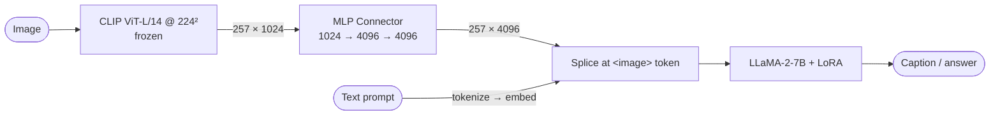
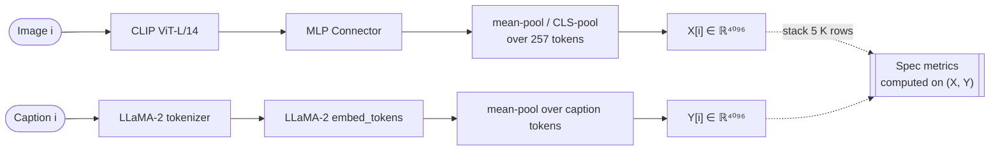

# Measuring the Modality Gap in MLLMs — Connector Ablation Study

> Master thesis project — Data Science & Engineering, a.y. 2025–2026

A four-condition ablation study isolating where the **modality gap** is opened or closed
in a CLIP-ViT → MLP-connector → LLaMA-2 multimodal LLM. The gap is measured at the
**connector output** (4096-dim LLM input-embedding space) — the only point in the
forward pass where image tokens and text tokens are commensurate.

---

## Research question

The papers that characterize the modality gap (Liang 2022; ReAlign; AnisoAlign) measure
it in CLIP-style contrastive spaces. Inside an MLLM, image and text only meet **after**
the connector has projected vision features into the LLM's input space. The thesis asks:

> Which training stage — contrastive Stage-1 pretraining of the connector, or
> instruction-tuning Stage-2 — actually closes the gap at the LLM-input boundary?
> And does either stage trade gap-closure against downstream task quality?

The 4-condition design factorizes Stage-1 and Stage-2 to attribute each effect.

| Condition | Stage 1 (InfoNCE pretrain) | Stage 2 (LoRA SFT) | Measured at | Downstream eval |
|---|---|---|---|---|
| **C0** | — (random connector) | — | random connector | none (no trained LLM) |
| **C1** | — | LLaVA-Instruct-150K | post-Stage-2 connector | captioning + VLMEvalKit |
| **C2** | Bunny-v1.1 InfoNCE | — | post-Stage-1 connector | captioning + VLMEvalKit |
| **C3** | Bunny-v1.1 InfoNCE | LLaVA-Instruct-150K | post-Stage-1 **and** post-Stage-2 | captioning + VLMEvalKit |

C3 contributes **two** measurements (post-Stage-1 and post-Stage-2) so the Stage-2
contribution can be isolated within the same training trajectory.

---

## Architecture

| Component | Choice |
|---|---|
| Vision encoder | `openai/clip-vit-large-patch14` @ 224² · frozen |
| Visual tokens | 257 × 1024 (CLS + 16×16 patches) |
| Connector | 2-layer MLP + GELU; `1024 → 4096 → 4096` (~17 M params) |
| LLM | `meta-llama/Llama-2-7b-hf` · frozen weights, LoRA-tunable in Stage 2 |
| Stage 1 loss | Symmetric InfoNCE with learnable temperature τ (init `1/0.07`) |
| Stage 1 image side | `mean_pool(connector(ViT(image)))` → ℝ⁴⁰⁹⁶ |
| Stage 1 text side | `mean_pool(llama_embed(tokenize(caption)))` → ℝ⁴⁰⁹⁶ |
| Stage 2 loss | AR cross-entropy on text positions only (visual tokens masked) |
| Stage 2 adaptation | LoRA r=16, α=32, dropout 0.05 on `{q,k,v,o,gate,up,down}_proj` |
| Stage 1 data | `BoyaWu10/Bunny-v1.1-data` (~2 M image-caption pairs) |
| Stage 2 data | `liuhaotian/LLaVA-Instruct-150K` |
| Diagnostic + eval set | COCO val2017 (5 K images, 5 reference captions each) |

### Inference pipeline



### Gap measurement (connector output)

For each (image, caption) pair in the COCO val2017 diagnostic sample we form one row of
`X` (image side) and one row of `Y` (text side) in ℝ⁴⁰⁹⁶:



All eigendecompositions and inner products are performed in **Float64** on CPU via
`scipy.linalg.eigh`. The Float64 boundary is enforced at the entry of every metric
function (`_to_f64`).

---

## Diagnostic metrics

Implemented in `src/diagnostics/metrics.py`. The spec's canonical metric set:

| Symbol | Name | Formula sketch |
|---|---|---|
| `G_mu` | Centroid gap | `‖μ_x − μ_y‖₂` |
| `alpha` | Power-law exponent | log-log slope of sorted eigenvalues of Σ_x (and Σ_y) |
| `JS_angular` | Angular JS divergence | Jensen-Shannon between pairwise-cosine-angle histograms of the two modalities |
| `kNN_mix` | kNN mixing rate | fraction of k=20 neighbours from the *other* modality |
| `||β||` | Pair-mean bias | `‖(1/n) Σᵢ (xᵢ − yᵢ)‖₂` |
| `||γ||` | Centroid-of-bias residual | per-pair bias energy beyond the global centroid offset |
| `κ(Σ_U)` | Image covariance condition number | `λ_max(Σ_x) / λ_min(Σ_x)` (clamped) |
| `κ(Σ_V)` | Text covariance condition number | `λ_max(Σ_y) / λ_min(Σ_y)` |
| `eff_rank_x`, `eff_rank_y` | Effective rank | `tr(Σ)² / tr(Σ²)` for each modality |
| `tr(Σ_x)`, `tr(Σ_y)` | Trace | total variance per modality |

`GapMetrics` (a dataclass) serializes the canonical set to JSON; legacy metrics
(`G_Sigma`, `A_r`, `O_q`, …) are preserved in an `extras` field for cross-checks.

The trajectory plot `plot_gap_decomposition` overlays `‖β‖, ‖γ‖, κ(Σ_U), κ(Σ_V)`
across the five measurement points (C0 → C1 → C2 → C3-stage1 → C3-stage2).

---

## Downstream evaluation

**Captioning quality** (COCO val2017, pycocoevalcap):
CIDEr (primary), BLEU-4, METEOR, SPICE.

**VLMEvalKit benchmarks** (`src/evaluation/vlmevalkit_adapter.py`):

| Group | Benchmarks |
|---|---|
| General perception | MME · MMStar · ScienceQA_VAL (image) · RealWorldQA |
| Complex reasoning | MMMU_DEV_VAL · MMMU_Pro · VisuLogic · LogicVista |
| Hallucination | CRPE · POPE · HallusionBench |

C0 has no trained LLM and is skipped for downstream eval; C1/C2/C3 all run the full
suite.

---

## Repository layout

```
configs/
  encoders.yaml             CLIP ViT-L/14 @ 224 config
  projector.yaml            MLP connector: 1024 → 4096 → 4096
  llm.yaml                  LLaMA-2-7B config (HF id, dtype, <image> token)
  data.yaml                 Bunny-v1.1 · LLaVA-Instruct-150K · COCO val2017 paths
  captioning.yaml           Generation + COCO val2017 eval config
  training_stage1.yaml      InfoNCE schedule, learnable τ
  training_stage2.yaml      LoRA targets, hyperparameters
  deepspeed/{zero2,zero3}.json

src/
  encoders/
    base.py                 VisionEncoder protocol
    clip_encoder.py         Plain CLIP ViT-L/14 wrapper → (B, 257, 1024)
  models/
    projector.py            MLP2xGELU (1024 → 4096 → 4096)
    vlm.py                  Encoder + connector + LLaMA-2 splice
    checkpoint.py           Save/load helpers
  data/
    coco_val2017_loader.py  5 K val images + 5 references each + diagnostic sampler
    bunny_v1_1_loader.py    Bunny-v1.1 image-caption pairs (Stage 1)
    llava_instruct_loader.py  LLaVA-Instruct-150K conversations (Stage 2)
    transforms.py           Image preprocessing (224 default)
  training/
    contrastive_loss.py     LearnableTemperature + symmetric InfoNCE
    stage1_pretrain.py      InfoNCE pretraining loop
    stage2_sft.py           LoRA SFT loop
    trainer_utils.py        AdamW + cosine schedule + freeze helpers
  diagnostics/
    extract_projected.py    Per-condition (image, text) row extraction in ℝ⁴⁰⁹⁶
    metrics.py              Spec metrics + Float64 discipline
    plots.py                Per-condition figures + trajectory plot
  captioning/
    inference.py            VLM.generate loop over COCO val2017
    evaluation.py           Generic pycocoevalcap scorer
  evaluation/
    vlmevalkit_adapter.py   LlamaConnectorVLM adapter for VLMEvalKit
  utils/{io,reproducibility,distributed}.py

scripts/
  00_setup_env.sh
  01_download_data.sh       COCO val2017 + train2017 + Bunny-v1.1 + LLaVA-Instruct-150K
  03_compute_gap.py         Per-condition gap metrics → JSON
  04_make_plots.py          Per-condition figures + trajectory
  05_train_stage1.py        InfoNCE pretraining
  06_train_stage2.py        LoRA SFT
  07_extract_projected.py   --condition {C0,C1_stage2,C2_stage1,C3_stage1,C3_stage2}
  08_run_captioning.py      --condition <tag> → captions_<tag>.json
  09_score_captions.py      --condition <tag> → captioning_<tag>.json
  10_run_vlmevalkit.py      --condition <tag> → vlmevalkit_<tag>.json
  run_condition.py          End-to-end orchestrator for C0/C1/C2/C3

tests/
  test_clip_encoder.py
  test_projector.py
  test_contrastive_loss.py
  test_metrics.py
  test_data_loader.py
  test_conditions.py        Dry-run smoke for the 4-condition orchestrator
```

---

## Setup

### Prerequisites

- Python 3.10
- CUDA 12.1+ recommended; bf16-capable GPU
- HuggingFace account with access to `meta-llama/Llama-2-7b-hf` (gated)
- ~150 GB free disk for datasets and checkpoints

### Install

```bash
python -m venv .venv && source .venv/bin/activate
pip install -e ".[train,dev]"
bash scripts/01_download_data.sh
```

---

## Running the ablation

Each condition is fully orchestrated by `scripts/run_condition.py`:

```bash
python scripts/run_condition.py --condition C0   # random connector — gap only
python scripts/run_condition.py --condition C1   # Stage 2 from random connector
python scripts/run_condition.py --condition C2   # Stage 1 only, zero-shot LLM
python scripts/run_condition.py --condition C3   # Stage 1 → Stage 2
```

Per-step invocation is also supported:

```bash
# Stage 1 InfoNCE pretraining
python scripts/05_train_stage1.py --config configs/training_stage1.yaml

# Stage 2 LoRA SFT (init from Stage 1 connector for C3, from random for C1)
python scripts/06_train_stage2.py --config configs/training_stage2.yaml \
       --stage1-checkpoint outputs/checkpoints/stage1_connector.pt

# Gap measurement per condition
python scripts/07_extract_projected.py --condition C3_stage1
python scripts/03_compute_gap.py --condition C3_stage1
python scripts/04_make_plots.py --condition C3_stage1

# Downstream
python scripts/08_run_captioning.py --condition C3_stage2 \
       --vlm-checkpoint outputs/checkpoints/stage2_vlm_C3.pt
python scripts/09_score_captions.py --condition C3_stage2
python scripts/10_run_vlmevalkit.py --condition C3_stage2 \
       --vlm-checkpoint outputs/checkpoints/stage2_vlm_C3.pt
```

### Tests

```bash
pytest tests/ -v                            # full suite
pytest tests/ -m "not slow and not gpu"     # fast CI subset (no model loading)
```

---

## Reproducibility

Every script writes alongside its outputs:

- Config snapshot (full YAML used)
- Git commit hash
- `pip freeze` dump
- Random seeds (numpy, torch, Python)
- Hardware info (GPU model, CUDA version, driver)
- Walltime and peak GPU memory

`torch.backends.cudnn.deterministic = True` and `benchmark = False` are set globally.
Single-GPU Float32 runs are bit-exact reproducible; multi-GPU bf16 runs are not.

---

## References

```bibtex
@article{yu2026realign,
  title   = {ReAlign: Addressing the Modality Gap in Multimodal LLMs},
  author  = {Yu, Xiao-Ming and others},
  journal = {arXiv preprint arXiv:2602.07026},
  year    = {2026}
}

@article{yu2026aniso,
  title   = {AnisoAlign: Anisotropic Residual Structure in Multimodal Alignment},
  author  = {Yu, Xiao-Ming and others},
  journal = {arXiv preprint arXiv:2605.07825},
  year    = {2026}
}

@article{liang2022modality,
  title   = {Mind the Gap: Understanding the Modality Gap in Multi-modal Contrastive
             Representation Learning},
  author  = {Liang, Weixin and others},
  journal = {NeurIPS},
  year    = {2022}
}

@inproceedings{radford2021clip,
  title     = {Learning Transferable Visual Models From Natural Language Supervision},
  author    = {Radford, Alec and others},
  booktitle = {ICML},
  year      = {2021}
}

@article{touvron2023llama2,
  title   = {Llama 2: Open Foundation and Fine-Tuned Chat Models},
  author  = {Touvron, Hugo and others},
  journal = {arXiv preprint arXiv:2307.09288},
  year    = {2023}
}

@inproceedings{liu2023llava,
  title     = {Visual Instruction Tuning},
  author    = {Liu, Haotian and others},
  booktitle = {NeurIPS},
  year      = {2023}
}

@misc{vlmevalkit,
  title  = {VLMEvalKit: An Open-Source Toolkit for Evaluating Large Multi-Modality Models},
  author = {OpenCompass Contributors},
  year   = {2024},
  url    = {https://github.com/open-compass/VLMEvalKit}
}
```

---

## License

MIT (project code). Vendored third-party code retains its original license — see
`THIRD_PARTY_LICENSES.md`.
