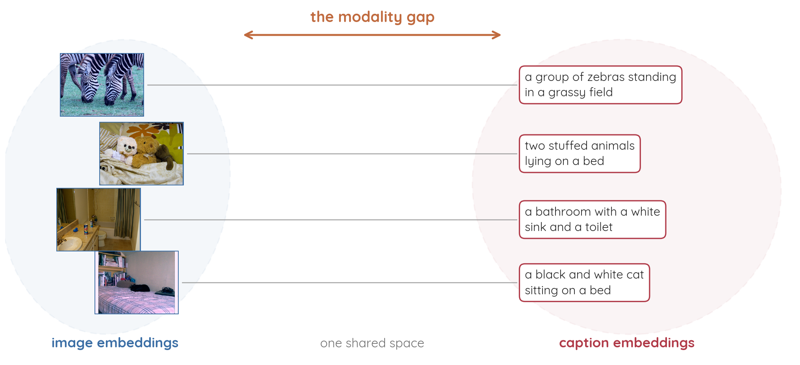
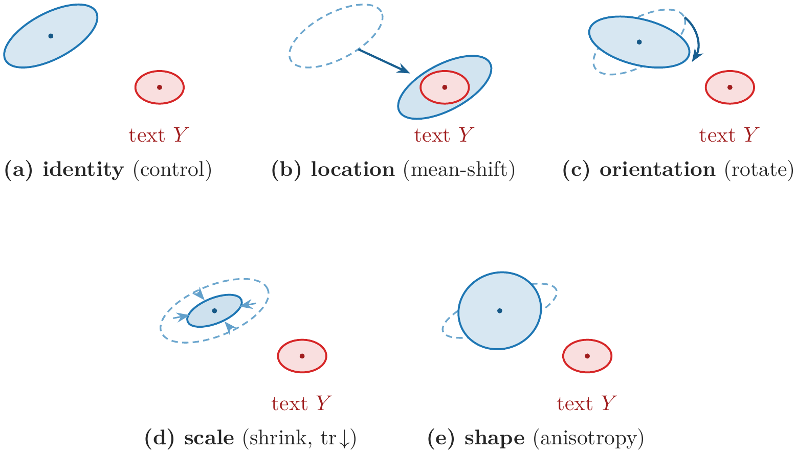
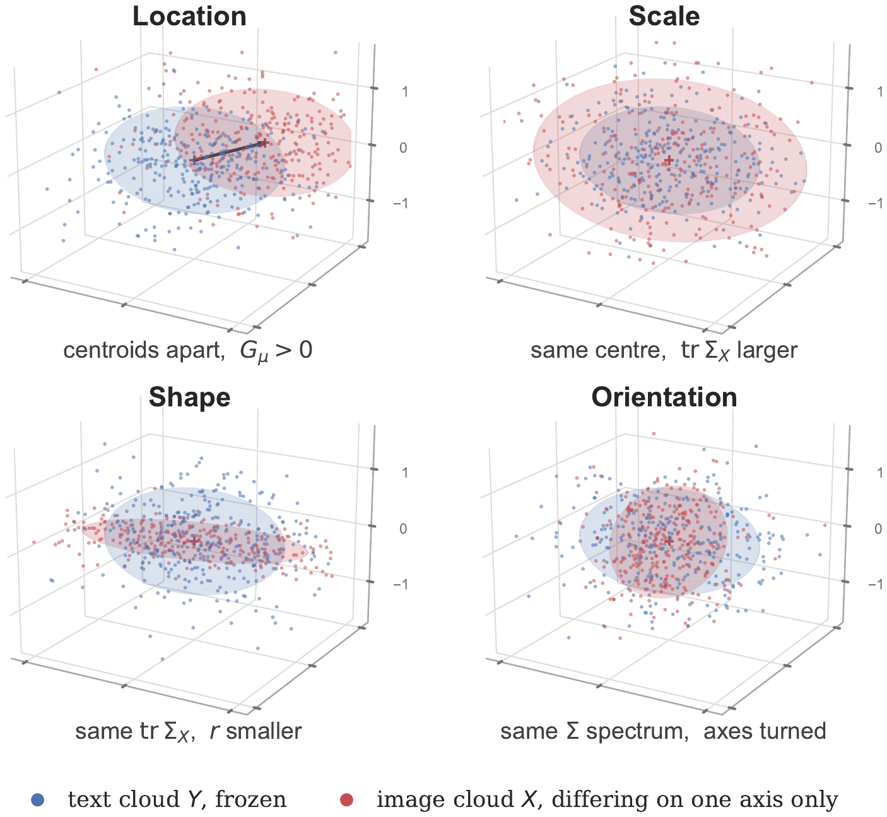
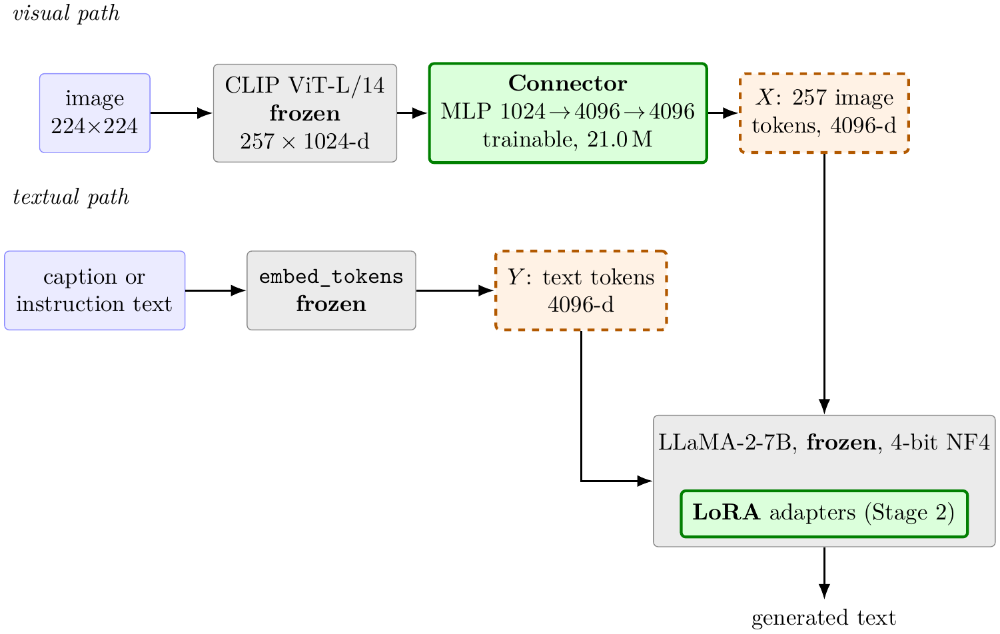
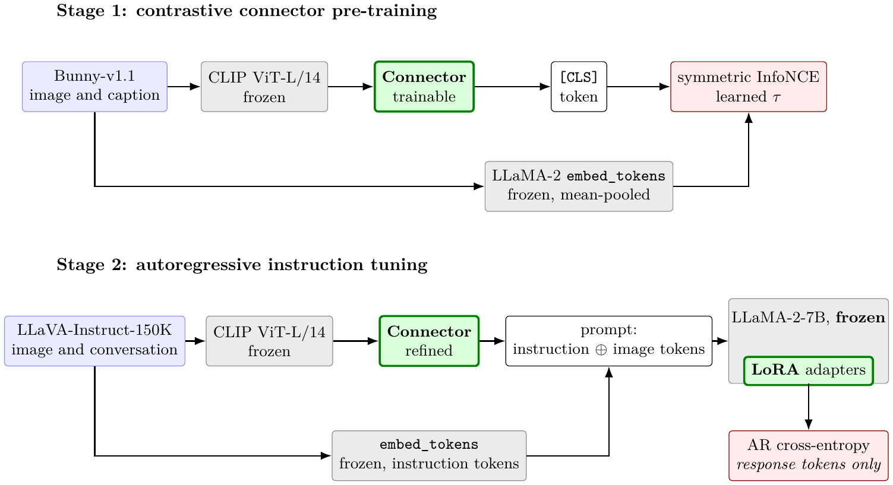
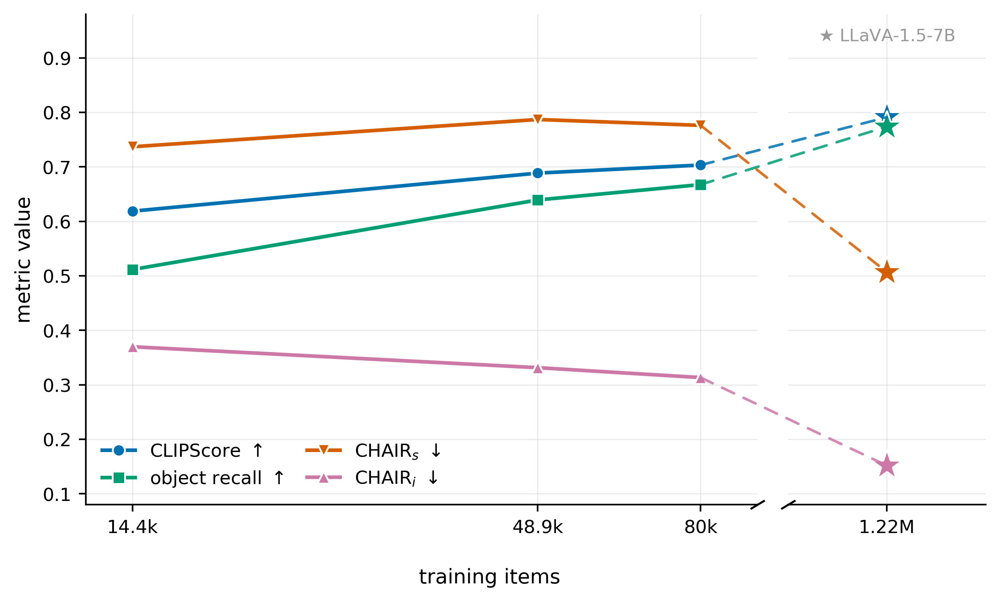

# Decomposing the Modality Gap

**Single-Axis Attribution of Representation Geometry in Multimodal Large Language Models**

> Master's thesis · Politecnico di Torino, Data Science and Engineering, a.y. 2025–2026
> Hassine El Ghazel · supervisors prof. Giuseppe Rizzo, Dr. Federico D'Asaro, Dr. Luca Catalano

---

## What this asks

In a connector-based multimodal LLM, projected visual tokens and text embeddings occupy separate
regions of the decoder's input space. That separation is the *modality gap*, and it is usually
reported as a single number: the distance between the two centroids.

A cloud can differ from another in more than its centre. This work splits the gap into **four
measurable axes**, drives **one at a time while pinning the other three**, and asks which of them a
frozen language decoder is actually sensitive to when it has to describe an image.

The gap is measured against the text the model **generates**, not against what it retrieves.

<p align="center">
  
</p>


---

## Headline result

Six conditions, identical budget, identical pins, one axis released each. Brief captioning,
MSCOCO `val2017`, n = 5,000; `z` is against the pinned baseline.

| condition | axis released | CLIPScore ↑ | z | verdict |
|:---|:---|---:|---:|:---|
| all-pinned | none | 0.5799 | - | control |
| **Cloc** | location | **0.6325** | **+22.9** | **the lever** |
| Cscale1500 | scale | 0.5466 | −12.8 | the mirror |
| Crank15 | shape | 0.5769 | −1.3 | a null |
| Corient | orientation | 0.5950 | +6.3 | weak |
| Clocorient | location + orientation | 0.6421 | +27.4 | confounded ¹ |

Closing the centroid distance raises CLIPScore by 0.0526 and improves object hallucination **and**
recall at the same time, so it is not a say-less trade. Compressing total variance is the exact
mirror: every metric moves the other way. Halving the effective rank changes nothing measurable.
Orientation returns about a third of what location returns.

¹ Clocorient's gain over Cloc cannot be credited to orientation: its centroid also closes further,
from 30.97 to 11.72.

<p align="center">
  
</p>

**Isolation is measured, not assumed.** Each condition moved its own axis by 45–116 % of the
baseline value while every off-target axis moved by at most 16 %.

---

## The four axes

Let $\bar x, \bar y$ be the cloud means and $\Sigma_X$ the image covariance, with eigenvalues
$\lambda_1 \ge \dots \ge \lambda_d$ and $d = 4096$. Everything is measured **at the connector
output**, because that is the input the decoder actually receives.

| axis | definition | plain meaning |
|:---|:---|:---|
| **Location** | $G_\mu = \lVert \bar x - \bar y \rVert$, $\;\widehat G_\mu = G_\mu / \sqrt{\mathrm{tr}\Sigma_X}$ | distance between the two centres |
| **Scale** | $s = \mathrm{tr}\Sigma_X = \sum_j \lambda_j$ | total variance of the image cloud |
| **Shape** | $r = (\mathrm{tr}\Sigma_X)^2 / \mathrm{tr}(\Sigma_X^2) \in [1,d]$ | how many directions the variance spreads over |
| **Orientation** | $O_q = \frac{1}{q}\lVert U_X^{(q)\top} U_Y^{(q)}\rVert_F^2 = \frac{1}{q}\mathrm{tr}(P_X P_Y)$ | overlap of the principal subspaces |

The diagnostic computes twenty scalars per checkpoint. Four survive three constraints:
**non-degeneracy** (must vary across conditions), **non-redundancy** (must not be an algebraic
function of one already kept), and **controllability** (must be drivable by a differentiable penalty
on a single batch of 64 images). Orientation overlap is read as a multiple of chance, $q/d$; results
use $q = 16$, where chance is $\approx 3.9 \times 10^{-3}$.

<p align="center">
  
</p>

<p align="center"><em>The text cloud is frozen; the image cloud differs on one axis only.</em></p>


---

## Architecture

Fixed across every condition. The connector is the only component that varies.

<p align="center">
  
</p>


| component | detail |
|:---|:---|
| Vision encoder | CLIP ViT-L/14 at 224 px, frozen, 257 visual tokens |
| Connector | `mlp2x_gelu`, 1024 → 4096 → 4096, 21.0 M parameters |
| Decoder | LLaMA-2-7B, 4-bit NF4 with double quantisation, bfloat16 compute |
| Adapters | LoRA r = 8, α = 16, dropout 0.05, on `q_proj` / `v_proj` / `o_proj` |
| Measurement point | connector output, 4096-d, mean over the 257 projected tokens |

---

## Training

Two stages, following the LLaVA recipe.

**Stage 1 · contrastive connector pre-training.** Only the connector moves. Each image is encoded by
the frozen vision tower, projected, and reduced to its `[CLS]` token; the paired caption is passed
through the frozen embedding table and mean-pooled. A symmetric InfoNCE objective with a learnable
temperature pulls matched pairs together. Data: Bunny-v1.1. This stage is what makes orientation a
manipulable axis: without an aligned reference there is nothing to rotate towards.

**Stage 2 · instruction tuning.** The connector is refined together with the LoRA adapters under an
autoregressive cross-entropy loss on response tokens only. The geometry terms enter here:

$$\mathcal{L} = 0.9\,\mathcal{L}_{\mathrm{AR}} + 0.1\,\mathcal{L}_{\mathrm{dist}}
              + 1.0\,\mathcal{L}_{\mathrm{scale}} + 1.0\,\mathcal{L}_{\mathrm{rank}}$$

The language term and the driven axis form a convex combination, so geometry is paid for out of the
language budget rather than added on top. The two pins are additive guards. Retargeting a pin instead
of removing it is what turns a pin into a drive.

| | Stage 1 | Stage 2 |
|:---|:---|:---|
| Objective | symmetric InfoNCE | AR cross-entropy (+ geometry terms) |
| Trainable | connector | connector and LoRA |
| Data | Bunny-v1.1 | LLaVA-Instruct-150K, ≈ 14,400 items |
| Learning rate | 5e-4, cosine, 3 % warm-up | 2e-4, cosine, 3 % warm-up |
| Batch | 64 | 4 × 8 accumulation (effective 32) |

<p align="center">
  
</p>

Every condition ran **450 optimizer steps**, about **9.1 % of one epoch**, on a **single RTX 2080 Ti
(11 GB)**, roughly 20 hours per scheduled job. bfloat16, seed 42.

---

## Evaluation

| regime | data | metrics |
|:---|:---|:---|
| Brief captioning | MSCOCO `val2017`, 5,000 images | CLIPScore, SPICE, METEOR, BLEU-4, CIDEr |
| Detailed description (`dd256`) | first 1,300 of `val2017`, 256-token cap | CLIPScore, CHAIR<sub>s</sub>, CHAIR<sub>i</sub>, object recall |

Three metric families, so no single scoring convention carries the claim: reference-free
(CLIPScore, ViT-B/32, $2.5 \cdot \max(\cos, 0)$), reference-based (SPICE, METEOR), and object
hallucination (CHAIR plus recall). The detailed regime drops the n-gram metrics, which need short
reference captions.

---

## Scaling the location drive

Location was the axis worth extending, so that configuration was carried further on the same
objective, the same pins and the same data stream. `dd256`, n = 1,300.

| | steps | items | CLIPScore ↑ | CHAIR<sub>i</sub> ↓ | recall ↑ |
|:---|---:|---:|---:|---:|---:|
| all-pinned | 450 | 14,400 | 0.5703 | 0.4396 | 0.4529 |
| Cloc | 450 | 14,400 | 0.6187 | 0.3698 | 0.5116 |
| Cloc_long | 1,529 | 48,928 | 0.6886 | 0.3314 | 0.6393 |
| **Cloc_80k** | **2,500** | **80,000** | **0.7033** | **0.3133** | **0.6675** |
| LLaVA-1.5-7B (reference) | - | ≈ 1.2 M | 0.7910 | 0.1518 | 0.7738 |

<p align="center">
  
</p>

Monotone, clearly diminishing, no collapse. Cloc_80k covers **60 %** of the CLIPScore distance to
the reference, 44 % of CHAIR<sub>i</sub> and 67 % of recall, with roughly fifteen times less data.
The reference is also advantaged elsewhere: 336 px inputs and 576 visual tokens against 224 and 257,
and an instruction-tuned decoder. It is a reference, not a competitor.

---

## Repository layout

```
configs/      YAML for encoders, projector, LLM, both training stages and the eval regimes
src/
  encoders/     frozen CLIP wrapper
  models/       connector, VLM splice, checkpoint I/O
  training/     stage 1 and stage 2 loops, geometry objectives
  diagnostics/  projected-embedding extraction, the 20-statistic suite, plots
  evaluation/   captioning and scoring helpers
  data/         COCO, Bunny, LLaVA-Instruct, DOCCI loaders
scripts/      numbered pipeline steps (03 gap, 05/06 train, 08 caption, 15 CLIPScore, 19 CHAIR, ...)
              plus the Slurm submission scripts for each condition
demo/         live side-by-side demo (see README_DEMO.md)
outputs/      checkpoints, predictions, metrics, logs
tests/        unit tests
```

## Reproducing

```bash
bash scripts/00_setup_env.sh          # Python 3.10, CUDA 12.1; uv preferred
bash scripts/01_download_data.sh

python scripts/05_train_stage1.py --config configs/training_stage1.yaml
python scripts/06_train_stage2.py --config configs/training_stage2.yaml

python scripts/07_extract_projected.py --condition <tag>
python scripts/03_compute_gap.py       --condition <tag>
python scripts/08_run_captioning.py    --condition <tag> --vlm-checkpoint <ckpt>
python scripts/15_clipscore.py         --condition <tag>
python scripts/19_chair.py             --condition <tag> --baseline C3pinr_dd256
```

On a Slurm cluster each condition has a submission script, for example
`scripts/submit_cloc_long.sbatch` and `scripts/submit_cloc_continue.sbatch` for the two rungs of the
scaling ladder. `java` is required on `PATH` for METEOR and SPICE.

---

## What this budget leaves open

- 450 optimizer steps, about 9.1 % of one epoch, on a single 11 GB GPU. The models are instruments,
  not competitive systems; every claim is a contrast between conditions sharing that budget exactly.
- One seed per condition. Reported standard errors describe variation across evaluation images, not
  across training runs.
- Only the location drive was carried past 450 steps, so the longer rungs have no matched
  all-pinned control at 1,529 or 2,500 steps.
- Captioning only. Whether the location axis matters for question-conditioned output is untested.

---

## Using this work

**Code** in this repository is licensed under the **GNU AGPL-3.0-or-later** (see `LICENSE`).
You may use, study, modify and redistribute it, including for research, provided derivative
works are released under the same licence. If you run a modified version as a network
service, the AGPL requires you to offer its source to users of that service.

**The thesis text, its figures and the generated captions** are not covered by that licence.
All rights in them are reserved by the author.

Vendored third-party files retain their original licences; see `THIRD_PARTY_LICENSES.md`.

If you use this code or results derived from it, please cite the thesis. `CITATION.cff`
carries the machine-readable record, and GitHub's "Cite this repository" button reads it.

Copyright (c) 2026 Hassine El Ghazel.
